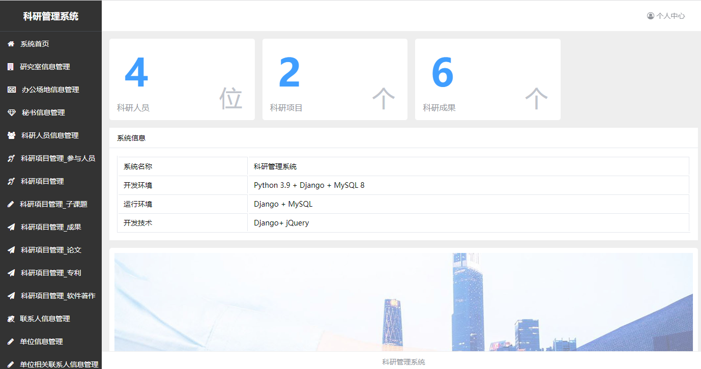
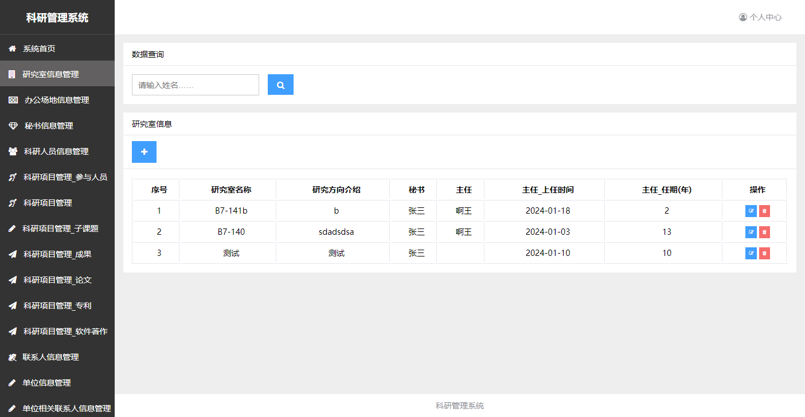
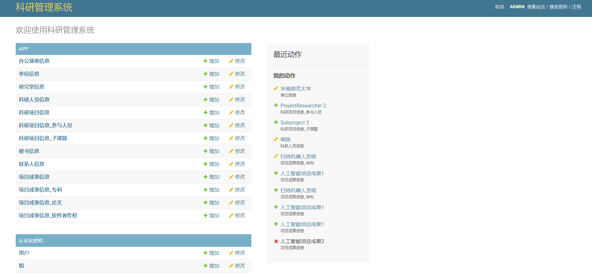
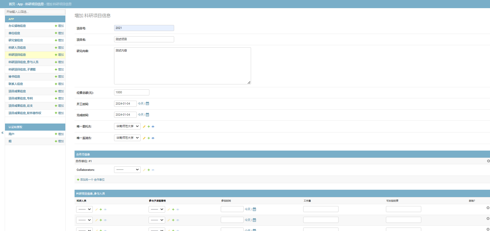
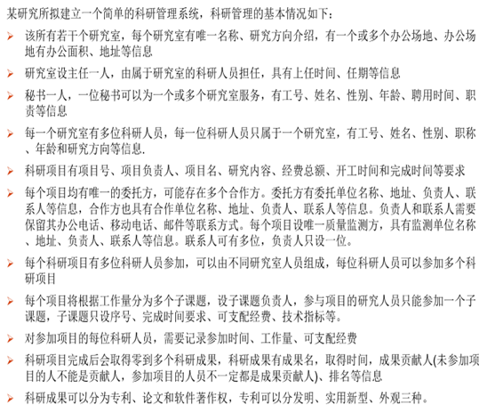
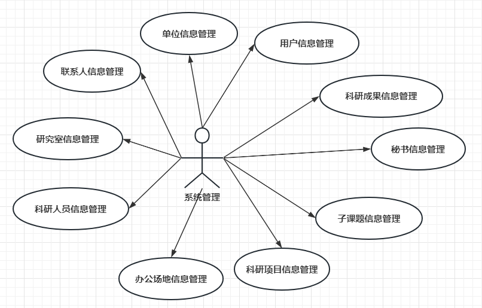
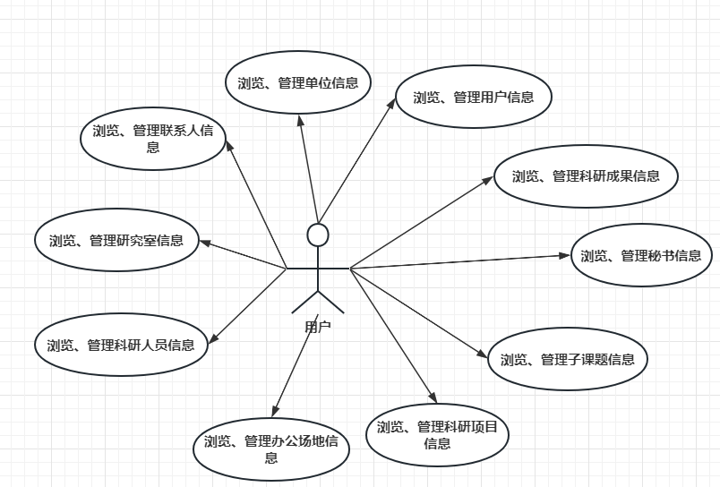
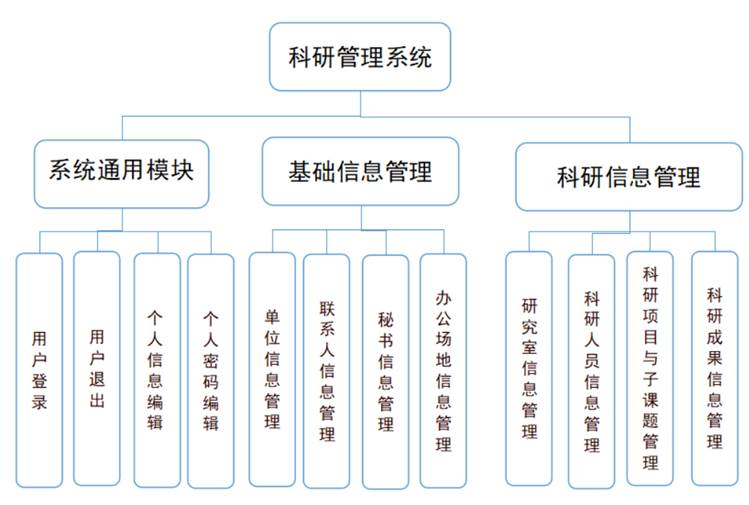
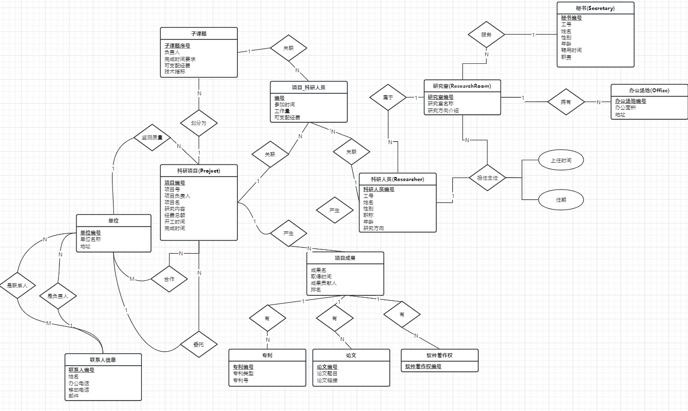

# SCUT-Assignment-ResearchMS
华南理工大学数据库课程大作业-科研管理系统

## 系统展示

#### 前端界面

#### Django内置管理界面

## 需求分析

#### 需求描述

#### 用例图

  
  

## 系统设计

#### 技术栈

- 开发语言：Python 3.9

- Web框架：Django

- 数据库管理系统：MySQL 8

- 运行环境：Django + MySQL

- 前端技术：Django + jQuery

#### 功能模块设计

#### ER图

## 安装运行方法

## 安装依赖

1. 解压项目，用pycharm打开studentjobs目录。 在pycharm配置python解释器，3.8及以上都可以。可以通过conda或者其他的虚拟环境来安装。
2. 打开mysql 创建库：CREATE DATABASE `researchms` DEFAULT CHARACTER SET utf8 (如果更换表的名字，请在settings文件里面修改相关配置)
3. 运行sql语句：INSERT INTO users (user_name, pass_word, name, gender, age, phone, type) VALUES ('admin', 'admin', '张三丰', '男', 45, '9018291092', 0);
4. 在pycharm终端依次输入python manage.py makemigrations和python manage.py migrate进行表结构迁移

## 运行

1. 运行服务器: python manage.py runserver
2. 进入系统：基于JavaScript和html开发的前端 127.0.0.1:8000/jobs/login
	基于Django集成开发环境开发的前端  127.0.0.1:8000/admin
3. 账号密码在数据库users表中，type字段0为管理员账号，用户名密码默认为admin。
